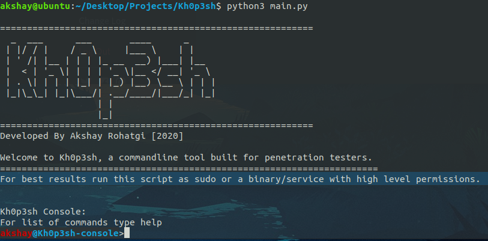
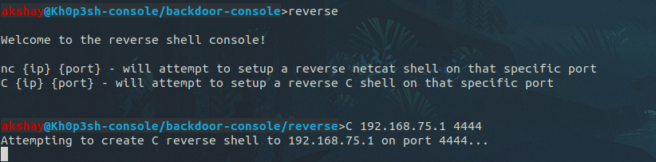
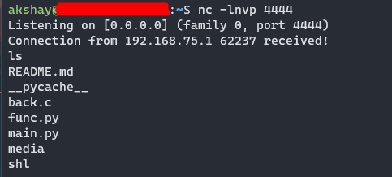
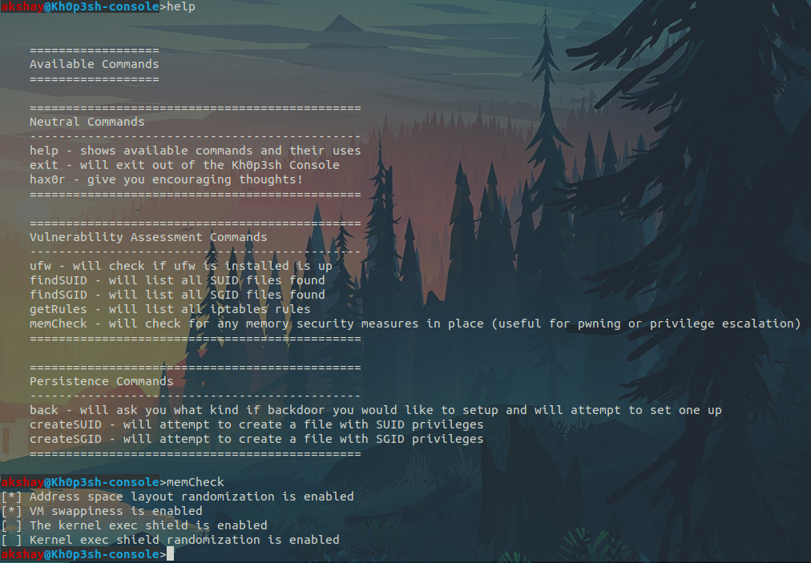
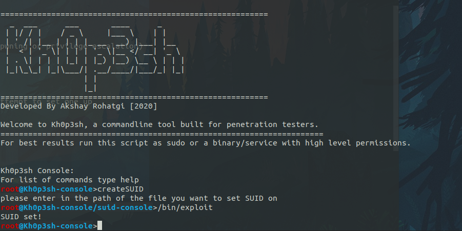

# Kh0p3sh :lock: 
- An all in one tool for quick vulnerability assessment and hardening OR system weakening for persistence while pentesting on UNIX-based operating systems. Educational cybersecurity tool, this is not meant to be used for any black hat hacking. 


To use simply clone the repository with:
```shell
git clone https://github.com/Akshay-Rohatgi/Kh0p3sh
```
- Only 2 files you really need when pentesting are func.py and main.py

Prerequisites:
```
python3

modules:
    getpass
    os
```

Information
  - Only has been tested on Debian-based operating systems

## Screenshots:

### Main Console:


### Backdoor function:



### Memory Check and SUID functions

